# Findu

Assistente financeiro para o dia a dia. O Findu junta extrato, metas e um chat que lê a sua vida financeira: você pergunta em texto, manda um áudio ou envia a foto de um boleto.

O app roda na web e no Android. No celular a navegação é de app de banco. No desktop a mesma conta abre com sidebar e painéis lado a lado.

## Prints

Telas do app publicado.

### Início

Saldo do mês, entradas, saídas e os atalhos de despesa, receita, comprovante e extrato.

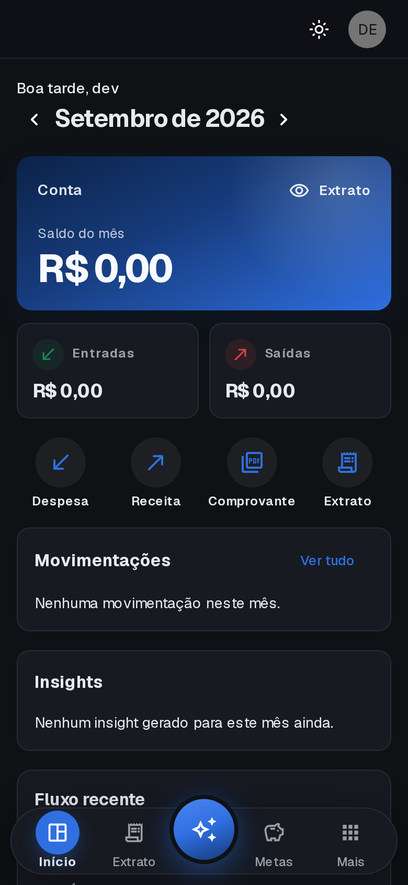

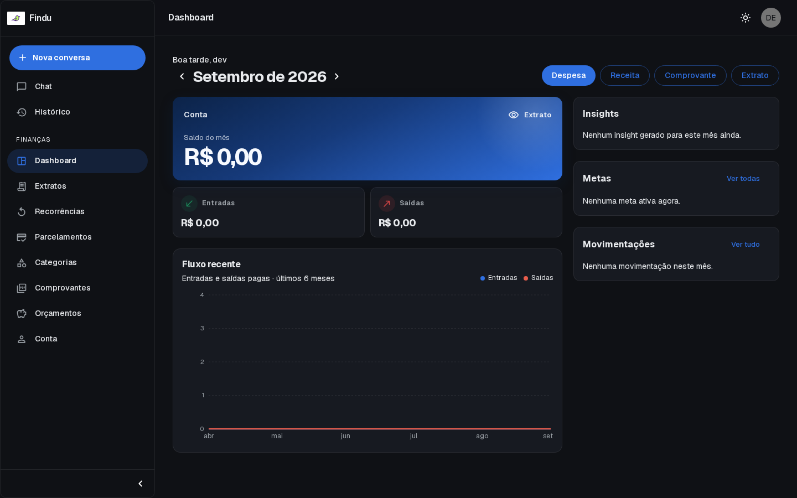

### Assistente

Perguntas prontas sobre o mês, onde cortar gasto, parcelas e reserva. Dá para escolher o modelo e o agente.

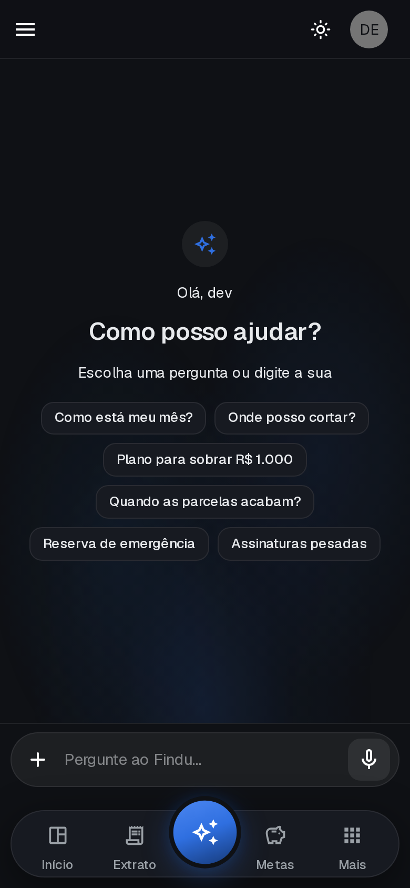

### OCR

Foto da câmera, imagem da galeria ou PDF. O assistente lê o documento e segue a conversa em cima dele. Também aceita áudio.

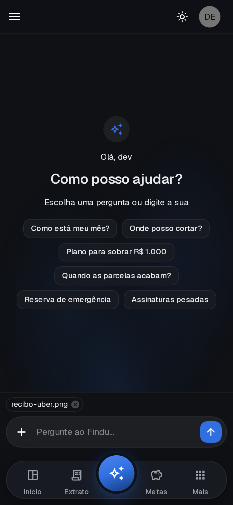

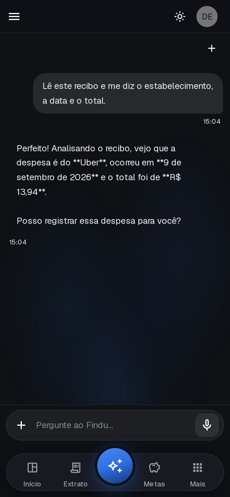

### Extrato

Meses anteriores e o detalhe do mês, com lançamentos pagos e pendentes.

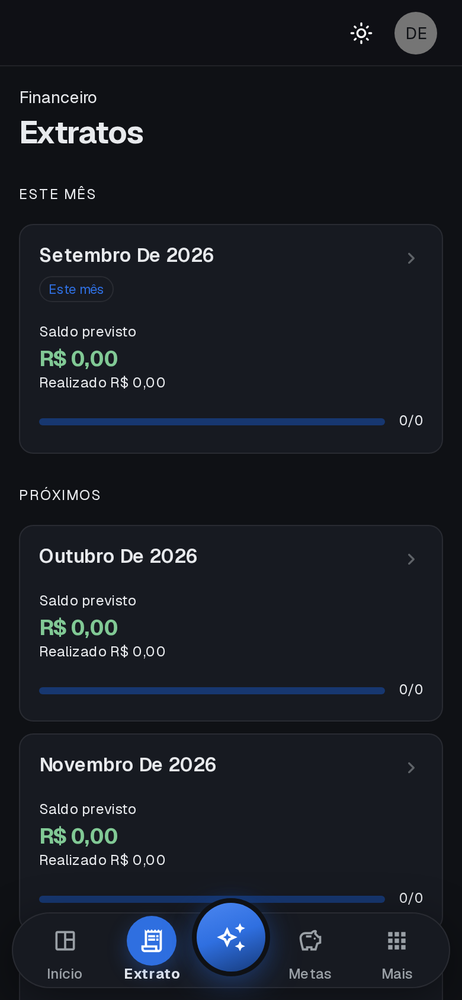

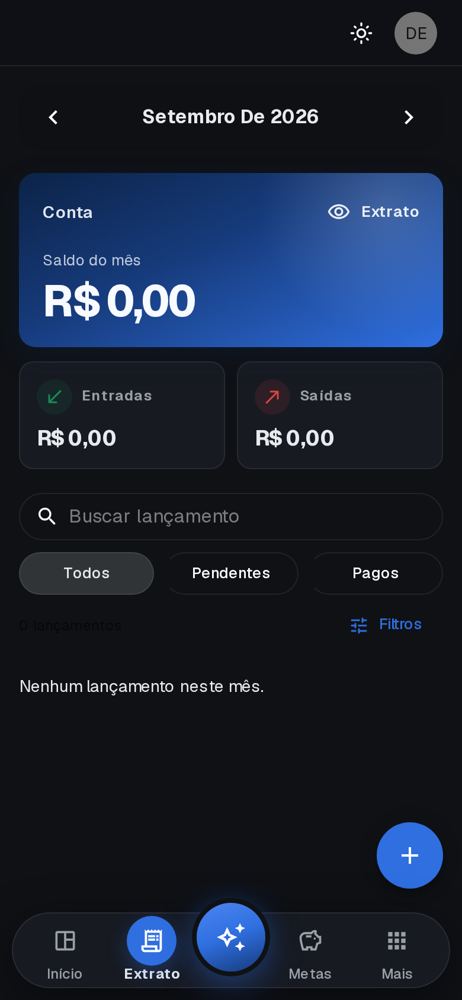

### Metas

Limite do período e quanto já foi usado.

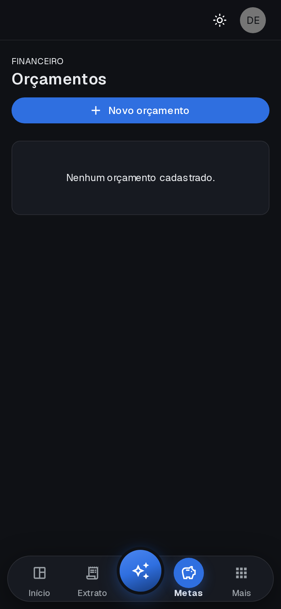

### Parcelas e recorrências

Parcelamentos perto do fim e contas que se repetem todo mês.

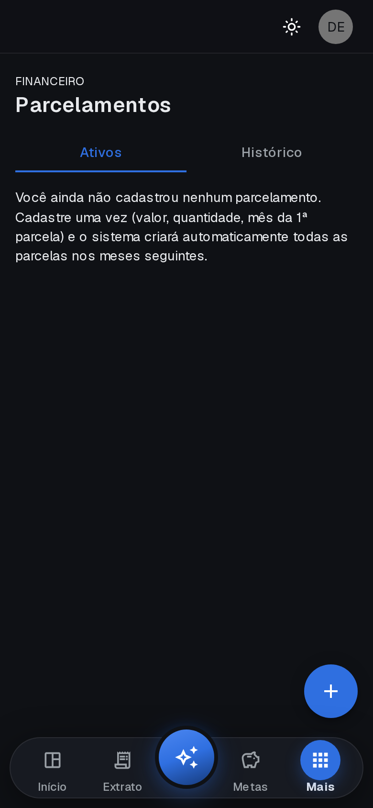

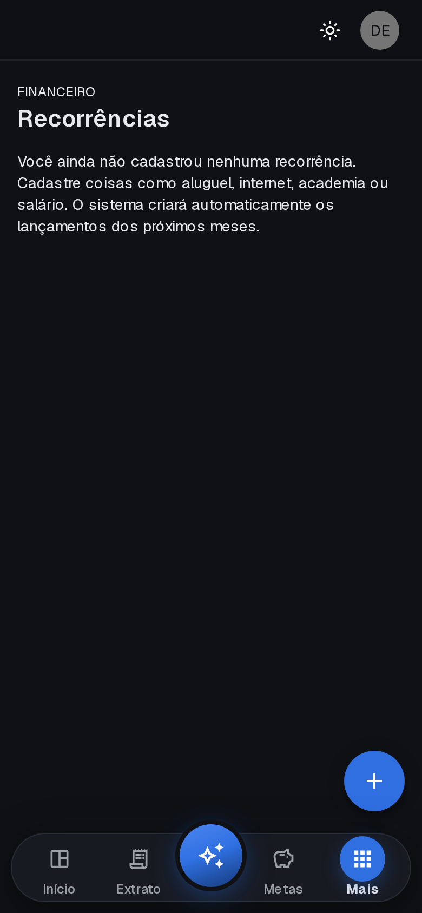

### Categorias e comprovantes

Gasto por categoria e comprovante em PDF, com envio pelo WhatsApp da categoria.

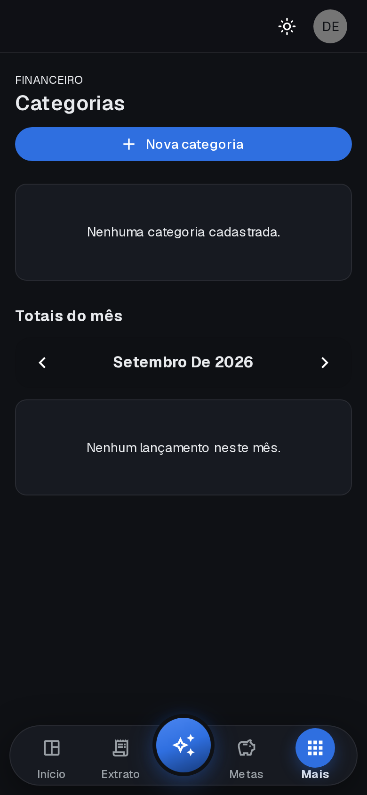

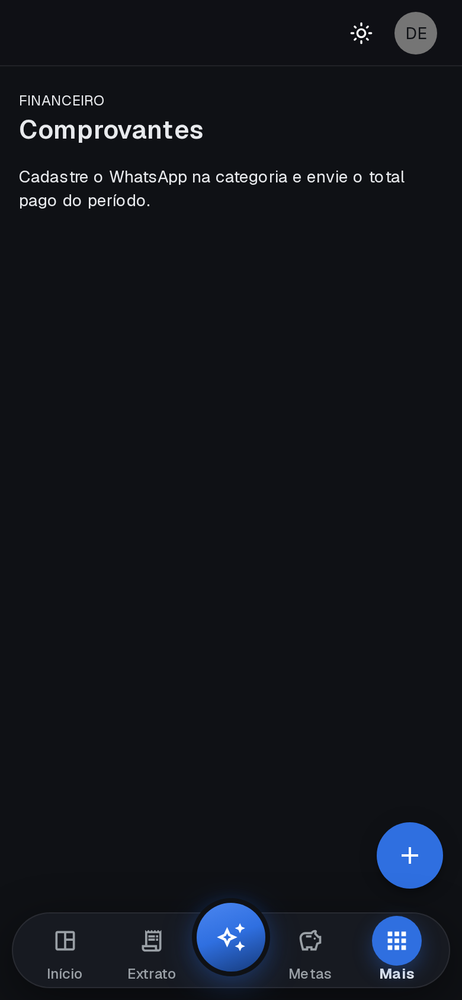

### Conta e acesso

Cadastro, login e, no Android, entrada com a digital do aparelho.


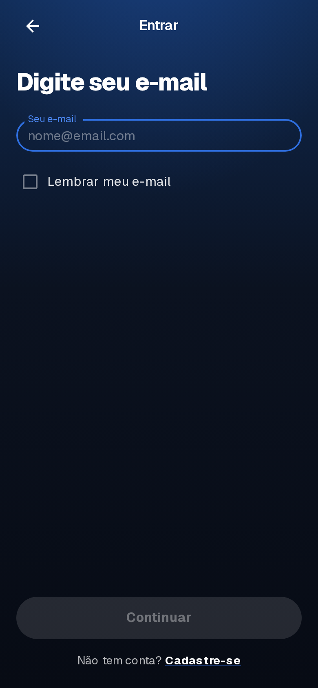

A entrada com digital só aparece no Android, com o app instalado. No navegador essa tela não existe.

## O que o app entrega

| Área | O que a pessoa faz |
| --- | --- |
| Assistente | Conversa sobre o próprio mês, corta gasto e monta um plano |
| OCR | Manda foto, câmera ou PDF para o assistente ler |
| Áudio | Grava uma mensagem em vez de digitar |
| Início | Vê saldo, fluxo dos últimos meses e insights |
| Extrato | Troca o mês e lança despesa ou receita |
| Metas | Acompanha o limite do período |
| Parcelas | Vê o que está acabando |
| Recorrências | Acompanha contas fixas |
| Categorias | Separa os gastos e guarda o WhatsApp de quem recebe o comprovante |
| Comprovantes | Gera o PDF e envia |
| Conta | Atualiza perfil e, no Android, ativa a digital |

## Como rodar

```bash
npm install
cp .env.example .env.local
npm run dev
```

Abre em [http://localhost:5147](http://localhost:5147).

`NEXT_PUBLIC_API_BASE_URL` no `.env.local` aponta para a API.

## Android

```bash
npm run build:mobile
npm run android:apk
```

O APK de debug sai em `android/app/build/outputs/apk/debug/app-debug.apk`.

O bundle (AAB) de debug:

```bash
npm run build:mobile
cd android && ./gradlew bundleDebug
```

O arquivo sai em `android/app/build/outputs/bundle/debug/app-debug.aab`.
